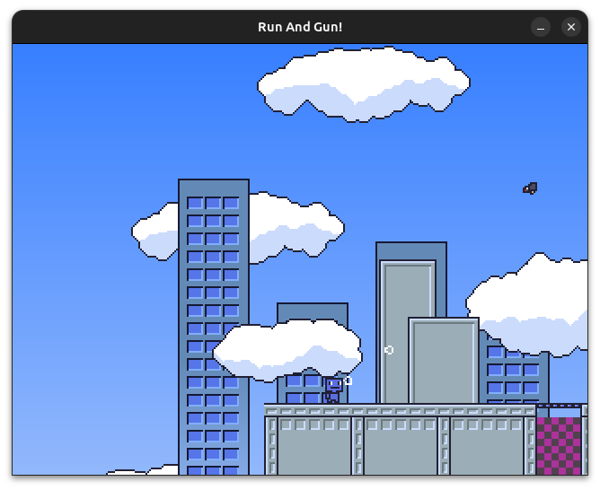

# Run and Gun Game

A simple 2D game based loosely on Contra and Megaman.



# Prerequisites
 - Debian-based Linux
 - CMake >= 3.12
 - GCC >= 10
 - SDL2 >= 2.0.18
 - SDL2_image
 - OpenGL 3.3 or higher

```bash
sudo apt install build-essential cmake libsdl2-dev libsdl2-image-dev
```

Some systems package an old version of SDL2 so ensure you have at least SDL2 2.0.18 installed.
Otherwise you may want to compile SDL2 manually. SDL2 has some instructions on how to install it
on your system.

# Optional

### Dependencies for automatic sprite definition updates
 - Aseprite in PATH or specify using -DASEPRITE_PATH=/path/to/aseprite
 - Python3

## Linux

## Build

This project uses Cmake and the built in package manager for Linux. VSCode is configured using [launch.json](./.vscode/launch.json) and [tasks.json](./.vscode/tasks.json) to use GDB for debugging and compiling the project every time you debug, given you do not want to run cmake and make yourself.

```bash
mkdir build && cd build
cmake ..
cd ..
make -C ./build levelEdit
```

## Running

Run the generated executable files from the **top directory of the project**. The executable files are named `rungun` and `levelEdit`.

To run the game, simply execute the following command in your terminal:
```bash
./build/rungun
```

To run the editor, simply execute the following command in your terminal:
```bash
./build/levelEdit
```

### Windows

Until a proper Windows port is made and tested, you can use WSL (Windows Subsystem for Linux) to download dependencies, build, and run the program. WSL can run graphical applications from its Linux Terminal, albeit with a slightly weird Window.
